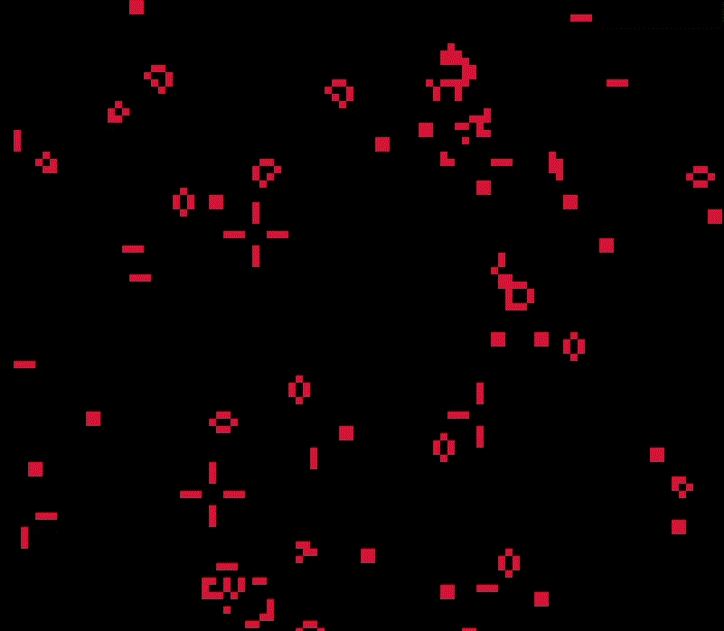

 

<h1>Welcome to Game of Life! </h1>

<div align="center">
    
</div>


## What is Game of Life?
The **game of life** is a cellular automaton divised by the British mathematician John H. Conway in 1970. It's a zero player game, meaning that its evolution is determined by its initial state, requiring no further input. We interact with the game of life by creating an initial configuration and then observing how it evolves.

It is also *Turing Complete*, meaning that it can simulate any turing machine.


## Compiling and Running
This project uses the library [raylib](https://github.com/raysan5/raylib) (version 4.5.0). Before doing the following steps, you must have raylib installed.

Clone the repository and access to its root directory
```
$ git clone https://github.com/RubioManuel/game-of-life
$ cd game-of-life
```
Use [GNU Make](https://www.gnu.org/software/make/) to compile it

```
$ make gol
```
or try with the following instruction
```
$ gcc ./src/gol.c ./src/grid.c -lraylib -lGL -lm -lpthread -ldl -lrt -lX11 -o ./bin/gol
```
This should output a binary file called `gol` in project's `bin/` directory.

Run the game
```
$ ./bin/gol
```